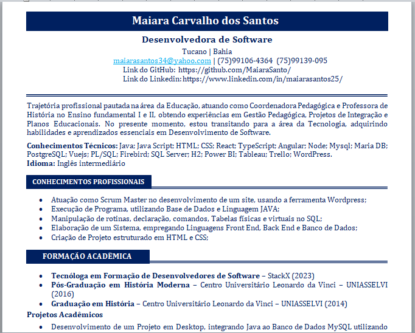
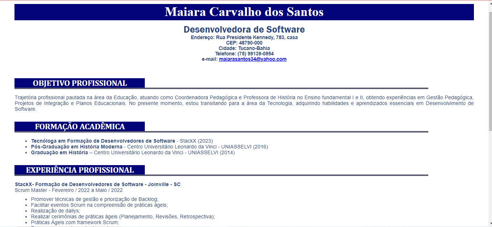

# Curriculo

# Currículo Feito no Módulo Básico I - Introdução ao HTML 
#
Foram utilizados tags em HTML como: Header, Span, h1, h2, h5, ul ( lista não ordenadas) e section;
#
Estilizações utilizadas no CSS: margin, padding, box-sizing, text-align, background, color,  background-position, font-family, width,font-size, margin-bottom, height, justify-conten;
#
A ideia é de criar um currículo do 0, tanto em HTML, quanto em CSS, estruturando e estilizando conforme a escolha própria. Decidir então recriar um portifólio que tenho, baseado nesta imagem a seguir:
#
  

#

E o resultado final foi este. Ao clicar irá diretamente ao protótipo pronto.

#
 
 ### 
 [Clique aqui para acessar o Projeto](https://curriculo-stackx.netlify.app/)
   
   ***
   
    
   
   ***
